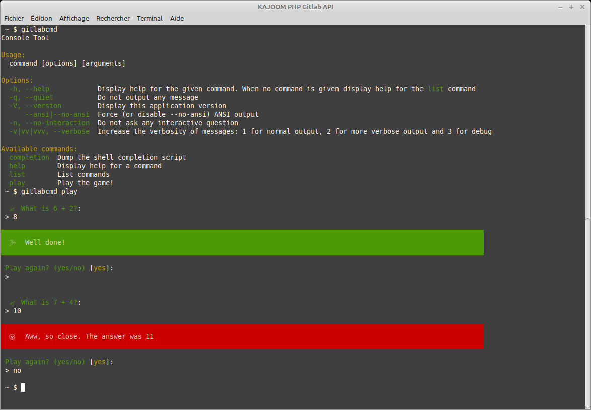

<h1 align="center">KAJOOM PHP Gitlab API</h1>

<p align="center">PHP command-line tool for Gitlab API.</p>

<p align="center">
    
    <p align="center">
        <a href="https://github.com/KAJOOM/PHP-Gitlab-API/actions"></a>
        <a href="//packagist.org/packages/kajoom/gitlab-api"></a>
        <a href="//packagist.org/packages/kajoom/gitlab-api"></a>
    </p>
</p>

## Install

This CLI application is a small game written in PHP and is installed using [Composer](https://getcomposer.org):

```
composer global require kajoom/gitlab-api
```

Make sure the `~/.config/composer/vendor/bin` or `~/.composer/vendor/bin` directory is in your system's `PATH`.

<details>
<summary>Show me how</summary>

If it's not already there, add the following line to your Bash configuration file (usually `~/.bash_profile`, `~/.bashrc`, `~/.zshrc`, etc.):

```
export PATH=~/.config/composer/vendor/bin:$PATH
```

If the file doesn't exist, create it.

Run the following command on the file you've just updated for the change to take effect:

```
source ~/.bash_profile
```
</details>

## Use

All you need to do is call the `gitlabcmd` command to start the game:

```
gitlabcmd play
```

## Update

```
composer global update kajoom/gitlab-api
```

## Delete

```
composer global remove kajoom/gitlab-api
```

## Notes

Currently just a proof-of-concept based on [this tutorial](https://tech.osteel.me/posts/how-to-build-and-distribute-beautiful-command-line-applications-with-php-and-composer) to serve as a template for PHP-CLI applications.  